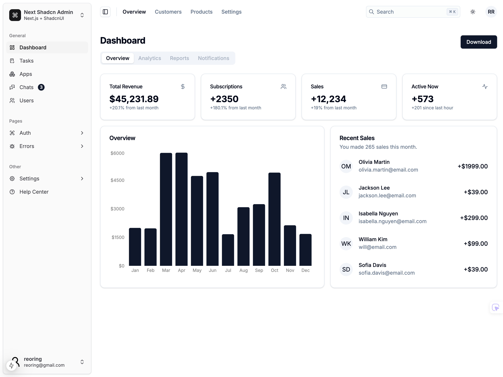

# Next.js Shadcn Admin Dashboard



A modern admin dashboard UI built with Next.js and Shadcn UI. This project is a Next.js port of the [original Shadcn Admin Dashboard](https://github.com/satnaing/shadcn-admin) by [@satnaing](https://github.com/satnaing), adapted to leverage Next.js features while maintaining the original's elegant design and functionality. The project has been restructured to use the Next.js App Router, providing better performance and developer experience while keeping all the powerful features of the original dashboard.

## Features

- 🌓 Light/Dark mode support
- 📱 Fully responsive design
- ♿️ Accessible components
- 🧭 Built-in Sidebar component
- 🔍 Global Search Command (⌘K)
- 📄 10+ pre-built pages
- 🧩 Extra custom components
- 📊 Dashboard analytics
- 📋 Data tables with advanced features
- 👥 Team management
- 🔐 Authentication layouts

## Tech Stack

- **Framework**: [Next.js 15](https://nextjs.org/)
- **UI Components**: [Shadcn UI](https://ui.shadcn.com/)
- **Styling**: [Tailwind CSS](https://tailwindcss.com/)
- **Icons**: [Tabler Icons](https://tabler-icons.io/)
- **Type Safety**: TypeScript
- **Code Quality**: ESLint & Prettier

## Getting Started

1. Clone the repository:
```bash
git clone https://github.com/reoring/next-shadcn-admin.git
```

2. Navigate to the project directory:
```bash
cd next-shadcn-admin
```

3. Install dependencies:
```bash
pnpm install
```

4. Start the development server:
```bash
pnpm dev
```

5. Open [http://localhost:3000](http://localhost:3000) in your browser to see the result.

## Project Structure

```
src/
├── app/                   # Next.js app router
│   ├── (auth)/           # Authentication routes
│   ├── (dashboard)/      # Dashboard routes
│   └── (errors)/         # Error pages
├── components/
│   ├── dashboard/        # Dashboard-specific components
│   ├── data-table/       # Advanced table components
│   ├── layout/          # Layout components (sidebar, header)
│   └── ui/              # Shadcn UI components
├── context/              # React Context providers
├── hooks/                # Custom React hooks
└── lib/                  # Utility functions
```

## Key Components

- **Dashboard Overview**: Analytics charts and recent sales data
- **Data Tables**: Advanced tables with sorting, filtering, and pagination
- **Team Switcher**: Easy organization switching
- **Command Menu**: Quick navigation and actions (⌘K)
- **Profile Dropdown**: User account management
- **Theme Switch**: Light/dark mode toggle
- **Responsive Sidebar**: Collapsible navigation menu

## Customization

The project uses Shadcn UI components which are fully customizable. You can modify the design system by editing:

- `tailwind.config.ts` for theme customization
- `components.json` for component configurations
- Individual components in `src/components/ui`

## Contributing

Contributions are welcome! Please feel free to submit a Pull Request.

## Credits

This project is a Next.js adaptation of the [original Shadcn Admin Dashboard](https://github.com/satnaing/shadcn-admin) created by [@satnaing](https://github.com/satnaing).

## License

Licensed under the MIT License. See LICENSE for more information.
